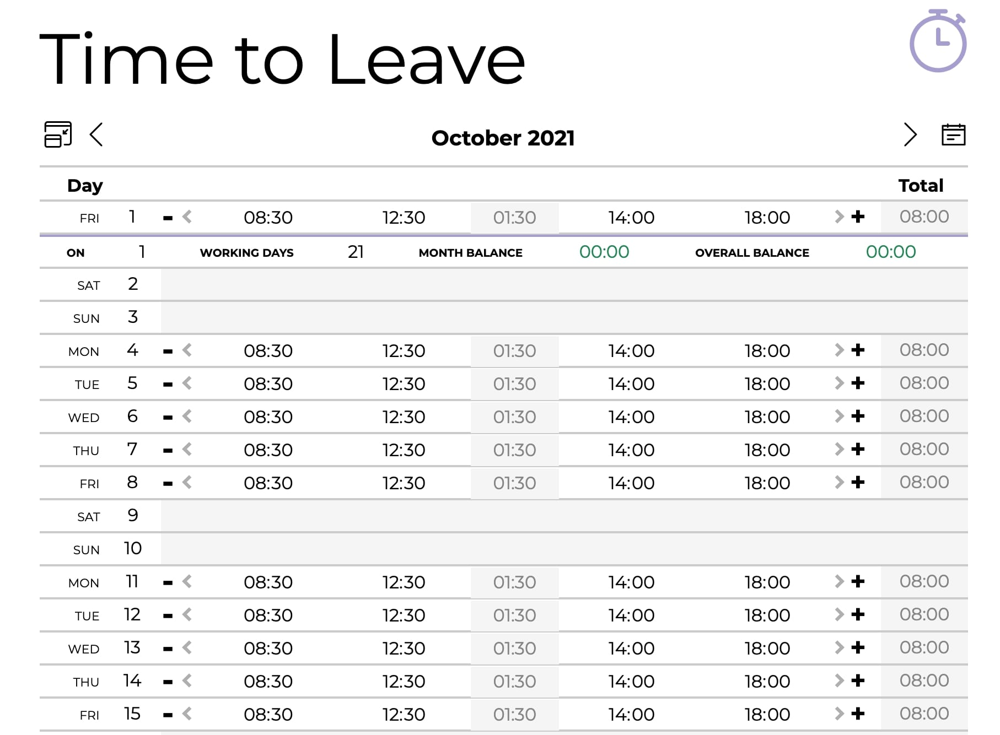

  

  
কাজের সময় লগ ইন করুন এবং অফিস থেকে বেরিয়ে আসার সময় এবং বিজ্ঞাপন পান

[timetoleave.app](https://timetoleave.app/)

   

  
  
  
  

   

  

   

---

আপনি আজ কাজ শুরু করার সময় লগ ইন করুন, এবং আপনি লাঞ্চে কাটানো সময় বিবেচনা করে আপনার অফিস থেকে বের হওয়ার সময়টি গণনা করা হবে। যখন সময় হবে, প্রোগ্রামটি আপনাকে অবহিত করবে।

আপনি আপনার কাজের দিন, আপনি দিনে কত ঘন্টা কাজ করেন এবং যদি আপনি একটি বিজ্ঞপ্তি পেতে চান বা না চান তা উল্লেখ করে পছন্দগুলি নিয়ন্ত্রণ করতে পারেন।

আপনি যে দিনগুলি কাজ করেননি সেদিন আপনি ছাড়ও যোগ করতে পারেন।

## কিভাবে TTL ইনস্টল করবেন

ছেড়ে যাওয়ার সময় ম্যাকওএস, উইন্ডোজ এবং লিনাক্সে কাজ করে এবং আপনি [সর্বশেষ প্রকাশ](https://github.com/thamara/time-to-leave/releases/latest) থেকে পছন্দসই সংস্করণটি ডাউনলোড করতে পারেন।

## কিভাবে টিটিএল তৈরি এবং অবদান রাখতে হয়

আপনি যদি সাহায্য করতে চান, আমাদের [অবদান](CONTRIBUTING.md) নির্দেশিকা পড়ুন।

আরো তথ্যের জন্য আপনি আমাদের [ডেভেলপমেন্ট গাইড](DEVELOPMENT.md) থেকেও জানতে পারেন।

## যোগাযোগ করুন!

আমাদের [ডিসকর্ড চ্যানেল](https://discord.gg/P3KkEF5) এ যোগ দিন আসন্ন বৈশিষ্ট্য এবং আরও অনেক কিছু নিয়ে আলোচনা করতে।

## ক্রেডিট

আইকন তৈরি করা হয়েছে [freepik](https://www.flaticon.com/authors/freepik) , [www.flaticon.com](https://www.flaticon.com).

View Switch আইকন তৈরি করা হয়েছে [Pixel perfect](https://www.flaticon.com/authors/pixel-perfect) from [www.flaticon.com](https://www.flaticon.com).
