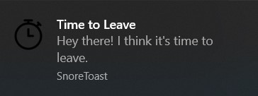
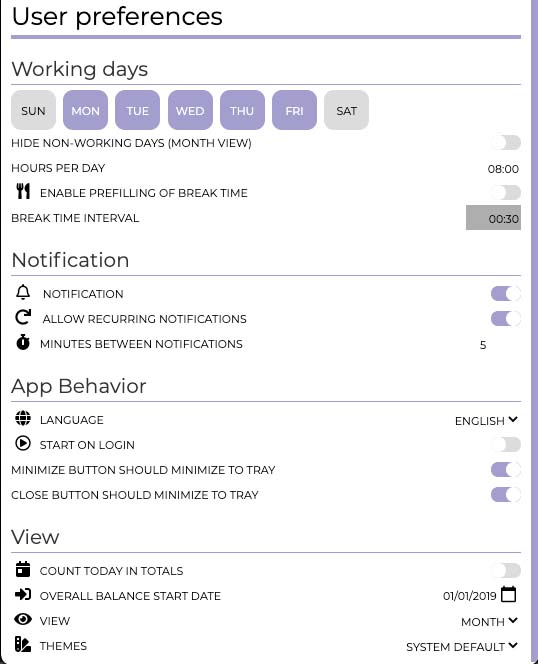
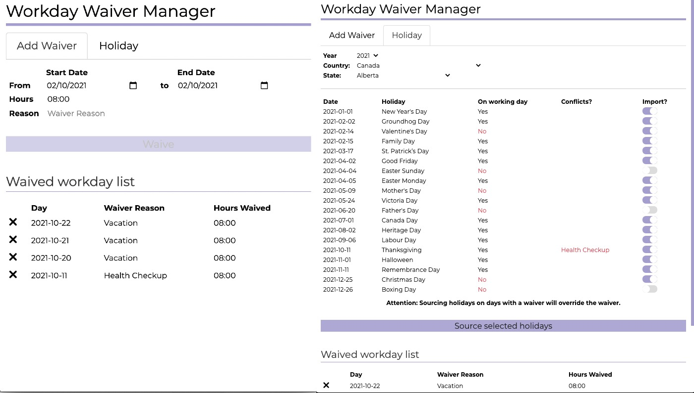

  

  
Erfasse deine Arbeitszeit und werde benachrichtigt, wenn es Zeit ist, das Büro zu verlassen und dein Leben zu genießen

[timetoleave.app](https://timetoleave.app/)

   

    

  

   

---

Erfasse die Zeit wann du deinen heutigen Arbeitstag angefangen hast und Time to Leave wird dir unter Berücksichtigung der Zeit die du beim Essen verbracht hast ausrechnen, wann du das Büro verlassen solltest. Wenn es Zeit ist zu gehen, wird dich Time to Leave benachrichtigen.

Du kannst folgende Einstellungen vornehmen, Arbeitstage, Arbeitstunden pro Tag und ob du benachrichtigt werden möchtest oder nicht.

Du kannst Tage an denen du nicht gearbeitet hast als Freizeit festlegen.

## TTL installieren

Time to Leave ist kompatibel mit MacOS, Windows und Linux. Du kannst die gewünschte Version von der [Release Seite](https://github.com/thamara/time-to-leave/releases/latest) herunterladen.

## Wie man TTL baut und dazu beiträgt

Wenn du helfen möchtest, lese unseren [Contribution-Leitfaden](../CONTRIBUTING.md).

Für mehr Information, kannst du dich auf unseren [Entwicklungsleitfaden](../DEVELOPMENT.md) beziehen.

## In Kontakt treten!

Tritt unserem [Discord Server](https://discord.gg/P3KkEF5) bei, um über anstehende neue Funktion und mehr zu diskutieren.

## Danksagungen

Icons von [freepik](https://www.flaticon.com/authors/freepik) von [www.flaticoncom](https://www.flaticon.com).

"View Switch" Icon von [Pixel perfect](https://www.flaticon.com/authors/pixel-perfect) von [www.flaticon.com](https://www.flaticon.com).
